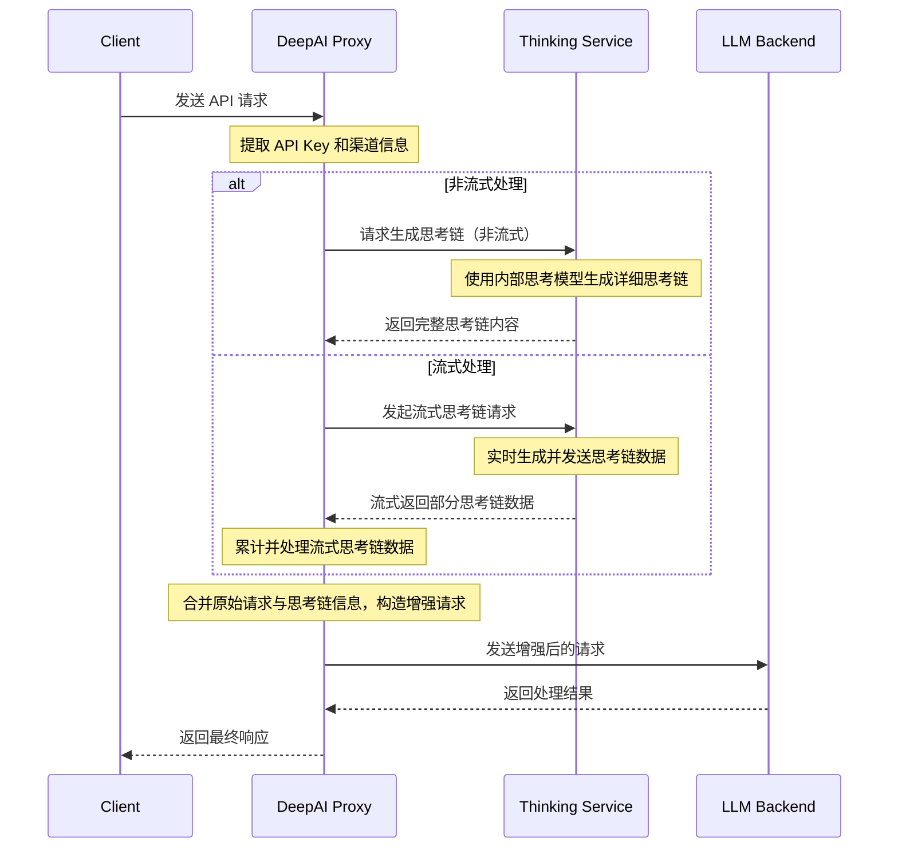
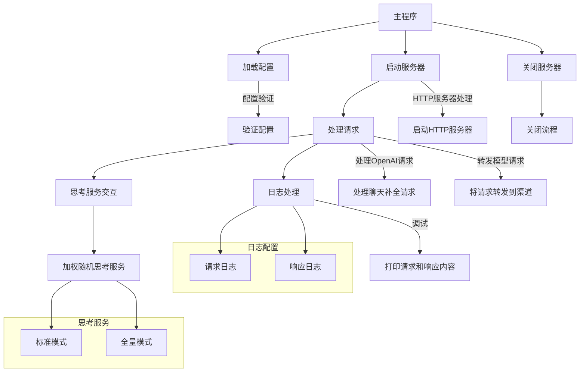
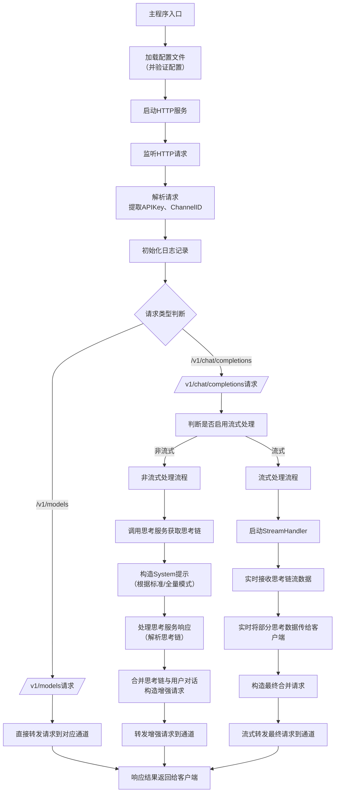

# DeepAI

DeepAI 是一个代理服务器，通过整合“思考链”过程来增强大型语言模型（LLM）的交互体验。它充当中间层，接收标准 OpenAI API 兼容请求，利用独立的“思考服务”生成推理过程，然后将增强后的请求转发到您选择的 LLM 后端。这使得响应不仅由 LLM 生成，而且还基于预先的推理分析，从而产生更具洞察力和连贯性的回答。

## 特性

- **OpenAI API 兼容性:**  
  无缝集成为 OpenAI API 设计的应用程序。DeepAI 支持 `/v1/chat/completions` 和 `/v1/models` 端点，方便接入现有应用。

- **思考链增强:**  
  在将用户请求发送给最终 LLM 之前，DeepAI 会自动调用预配置的“思考服务”，生成推理过程，并将该推理链（即 reasoning_content）合成到请求中，帮助 LLM 生成更具洞察力的回答。  
  - **标准模式（standard）** 仅使用推理链中的 `reasoning_content` 字段，并允许将该内容以 SSE 流形式转发给客户端；  
  - **完全模式（full）** 则收集并使用 `reasoning_content` 与 `content` 两部分（但完全模式下不显示思考链给客户端）。

- **灵活的后端支持:**  
  通过配置多个后端 LLM 服务（“渠道”）和思考服务，可根据需求自由切换或路由请求。

- **API 密钥路由:**  
  API 密钥前缀中的渠道 ID 用于路由，将请求交给相应的后端渠道，便于进行细粒度的服务控制。

- **流式与标准响应:**  
  支持聊天完成请求的流式和标准响应。流式模式下，思考服务生成的 SSE 流会原样转发（包含 reasoning_content 字段），便于客户端自行解析和展示。

- **加权随机选择:**  
  实现了基于比例权重的随机选择算法，从多个思考服务中以概率的方式选出一个服务。权重越高，被选中的概率越大。

- **代理支持:**  
  支持 HTTP 和 SOCKS5 代理，可用于连接思考服务和后端 LLM 渠道，适应各种网络环境。

- **全面日志记录与优雅关机:**  
  提供详细的请求日志（包含唯一请求 ID、时间戳等）以及优雅的关机处理，便于监控和调试。
  
---

## 为什么你需要用DeepAI

### 原因1：生成速度与成本优势

使用 R1 极速版生成思考后推送高速模型（如 grok2/3、gpt4o/4omini、Claude3.5s 等），可以节省一半以上的生成时间。同时，R1 输出不仅速度慢，成本也较高（“成本高”指的是后端输出可通过免费使用 Gemini 等模型实现）。

#### 模型TPS对比（OpenRouter数据）

**蒸馏版模型与特化版**

| 模型名称                          | 类型              | TPS       |
|---------------------------------|-----------------|-----------|
| Qwen32b 蒸馏版                   | 蒸馏版           |  40 TPS   |
| Llama70b 蒸馏版 (非特化)          | 蒸馏版           | 57 TPS    |
| L[lama70b 特化版 (Groq) ](https://console.groq.com/docs/reasoning)           | 特化版           | 280 TPS   |
| Llama70b 特化版 (SambaNova)       | 特化版           | 192 TPS   |
| Llama70b 特化版 (Cerebras)        | 特化版           | 1508 TPS  |

**DeepSeek系列**

| 模型            | TPS    |
|----------------|--------|
| DeepSeek R1    | 24 TPS |
| DeepSeek V3    | 17 TPS |

**主要竞争对手模型**

| 模型名称                      | TPS       |
|----------------------------|-----------|
| claude-3.5-sonnet          | 51 TPS    |
| claude-3.5-haiku           | 53 TPS    |
| grok-2                     | 62 TPS    |
| command-r-plus             | 60.41 TPS |
| command-r7b                | 154 TPS   |
| gpt-4o                     | 98 TPS    |
| o3-mini-high               | 119 TPS   |
| o1                         | 75 TPS    |
| gemini-2.0-flash           | 128 TPS   |
| gemini-2.0-pro             | 168.9 TPS |
| [gemini-2.0-flash-thinking](https://ai.google.dev/gemini-api/docs/thinking?hl=zh-cn)  | 225 TPS   |

> 从数据看，DeepSeek R1 和 V3 的TPS明显低于竞争对手。

---

### 原因2：输出上限与上下文长度

R1 的输出经常设置上限为 8K，而大部分平台（包括官方和国内大厂）的蒸馏模型输出上限可能更低（2K或4K），这使得其在生成长代码或长文章时受限。同时R1 的上下文主要为 64K 或 32K

| 模型                         | 上下文长度    | 输出上限  |
|----------------------------|-----------|---------|
| R1（DeepSeek）             | 32K / 64K | 8K      |
| command-r-plus             | 128K     | 4K      |
| command-r7b                | 128K     | 4K      |
| o3-mini-high               | 200K     | 100K    |
| o1                         | 200K     | 100K    |
| gpt-4o                     | 128K     | 16K     |
| gemini-2.0-flash           | 1000K    | 8K      |
| gemini-2.0-pro             | 2000K    | 8K      |
| gemini-2.0-flash-thinking  | 1000K    | 64K     |
| grok-2                     | 131K     | 131K    |
| claude-3.5-sonnet          | 200K     | 8K      |
| claude-3.5-haiku           | 200K     | 8K      |

> 备注：大部分平台的蒸馏模型输出上限可能低至2K或4K，标准版往往也就给8K，这限制了长代码或长文章的生成。

---

### 原因3：模型实力对比（LiveBench.ai Coding 排行）

| 模型              | 得分    |
|------------------|--------|
| o3-mini-high     | 82.74  |
| o1               | 69.69  |
| Claude 3.5S      | 67.13  |
| DeepSeek R1      | 66.74  |
| gemini-2.0-pro   | 63.49  |
| DeepSeek V3      | 61.77  |
| gpt-4o           | 60.56  |

>   R1 本身并非最强模型，其基础为 V3，而 V3 与行业顶级 T1 模型存在较大差距。相比最强的非思考模型（Claude 3.5S，67.13），V3 差距约 6 分；与谷歌的 2.0 pro 也存在少量差距。而在综合评分上，V3 甚至未能超越 gemini-2.0-flash。

---


## 快速开始

1. **下载可执行文件:**  
   请从 [发布版本](https://github.com/BlueSkyXN/DeepAI/releases) 下载适用于您平台的预编译二进制文件，或参考源码自行构建。或者从[工件](https://github.com/BlueSkyXN/DeepAI/actions)下载最新构建，但是可能BUG满天飞

2. **配置:**  
   基于仓库中提供的 `config-example.yaml` 模板创建 `config.yaml` 配置文件。  
   **重要提示：** 请正确配置您的思考服务和渠道。注意，目前配置模板中已移除未使用的字段，请参考下面的示例。

3. **运行 DeepAI:**  
   执行下载的二进制文件即可启动服务。

### Windows

在命令行中执行（确保 `config.yaml` 与可执行文件在同一目录）：

```bash
DeepAI-windows-amd64.exe
```

### Linux 等平台

同样在终端执行，配置文件放在相应目录中即可启动 HTTP 服务。

## 配置说明

DeepAI 通过 `config.yaml` 文件进行配置，请参考示例模板：

<https://github.com/BlueSkyXN/DeepAI/blob/main/config-example.yaml>

### 配置说明

* **thinking_services:**  
  - 每个思考服务必须配置：  
    - `id`：建议顺序指定 ID，便于记录和后续扩展。  
    - `name`：描述性名称，可自定义。  
    - `mode`：模式选择，"standard" 表示仅使用 reasoning_content（并支持 SSE 流展示思考链），"full" 表示收集所有内容，但不展示思考链。  
    - `model`、`base_url`、`api_path`、`api_key`：构成调用思考服务的完整请求参数。  
    - `timeout`：请求超时时间（秒）。  
    - `weight`：加权随机的比例权重，数值越高，被选中的概率越大。  
    - `proxy`：代理设置，留空则不使用代理。支持S5和HTTP。
    - `reasoning_effort` 与 `reasoning_format`：用于调整推理令牌数量和推理过程格式，选项见示例。  
    - `temperature`：温度参数，用于覆盖默认值。  
    - `force_stop_deep_thinking`：在标准模式下，如果检测到仅返回 content（且 reasoning_content 为空），是否立即停止思考链采集。
    - 目前只兼容OpenAI标准的接口，不支持其他接口，请自行编程转换或者使用OneAPI/NewAPI项目
    - 目前不兼容think标签的语法
* **channels:**  
  - 定义后端 LLM 渠道，每个渠道由唯一的字符串键标识，必须配置：  
    - `name`、`base_url`、`api_path`、`timeout`、`proxy`。
    - `name`: 渠道的描述性名称。
    - `base_url`: 目标 LLM API 的 Base URL。
    - `timeout`: 发送到此渠道的请求超时时间，单位秒。
    - `proxy`: 发送到此渠道的请求的可选代理 URL。
    - 目前只兼容OpenAI标准的接口，不支持其他接口，请自行编程转换或者使用OneAPI/NewAPI项目

* **global:**  
  - 配置日志和服务器相关参数，建议直接照抄示例。

## API 使用示例

向 DeepAI 发送聊天完成请求时，通过 `Authorization` 头中包含渠道 ID 来路由请求：

```bash
curl http://localhost:8888/v1/chat/completions \
  -H "Authorization: Bearer deep-1-sk-xxxx" \
  -H "Content-Type: application/json" \
  -d '{
    "model": "command-r-plus",             # 目标 LLM 渠道的模型
    "messages": [{"role": "user", "content": "你好"}],
    "stream": true
  }'
```

### API 密钥格式

`Authorization` 头格式如下：

```
Bearer <api_provider>-<channel_id>-<your_real_api_key>
```

其中：  
- `<api_provider>` 当前为 `deep`（小写）；  
- `<channel_id>` 为配置文件中定义的渠道 ID（例如 "1" 或 "2"）；  
- `<your_real_api_key>` 为实际的 API 密钥。  

例如，如果您的真实 API 密钥为 `sk-12345678`，且希望使用渠道 1，则完整格式为：  
```
Bearer deep-1-sk-12345678
```


## 系统架构






## Star History

[](https://star-history.com/#BlueSkyXN/DeepAI&Date)
