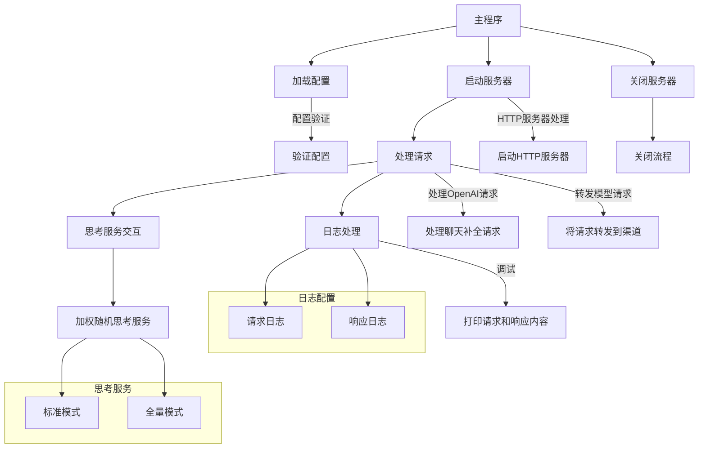

# DeepAI

DeepAI 是一个代理服务器，旨在通过整合“思考链”过程来增强大型语言模型 (LLM) 的交互体验。它充当中间层，接收标准的 OpenAI API 兼容请求，利用独立的“思考服务”生成推理过程，然后将增强后的请求转发到您选择的 LLM 后端。这使得您获得的响应不仅由 LLM 生成，而且还基于预先的推理分析，从而可能产生更具洞察力和连贯性的输出。

## 特性

- **OpenAI API 兼容性:**  无缝集成为 OpenAI API 设计的应用程序。 DeepAI 支持 `/v1/chat/completions` 和 `/v1/models` 端点，确保轻松接入。
- **思考链增强:**  在将用户请求发送到最终 LLM 之前，自动使用专门的“思考服务”生成的推理过程来丰富请求内容。
- **灵活的后端支持:**  配置多个后端 LLM 服务（“渠道”）和思考链服务。根据您的需求轻松切换或将请求路由到不同的服务。
- **API 密钥路由:**  采用独特的 API 密钥路由机制。API 密钥前缀决定了哪个后端渠道将处理请求，从而为服务使用提供精细的控制。
- **流式和标准响应:**  支持聊天完成的流式和标准响应，为不同的应用程序需求提供灵活性。思考过程的实时流式传输增强了用户体验。
- **加权思考服务选择:**  实现加权随机选择算法，用于从多个思考服务中进行选择，从而允许基于服务权重进行负载均衡和优先级排序。
- **代理支持:**  支持 HTTP 和 SOCKS5 代理，用于连接思考服务和后端 LLM 渠道，适应各种网络环境。
- **强大的日志记录:**  全面的请求日志记录，包括唯一的请求 ID、时间戳和内容日志记录（在调试模式下），以便进行有效的监控和调试。
- **优雅关机:**  确保在接收到中断信号时平稳地关闭服务器，防止数据丢失并确保干净的退出。

## 快速开始

1. **下载可执行文件:** 从 [发布版本](https://github.com/BlueSkyXN/DeepAI/releases) 部分下载适用于您平台的预编译可执行文件（或从源代码构建 - 请参阅下文）。或者从[工件](https://github.com/BlueSkyXN/DeepAI/actions)下载最新构建

2. **配置:** 基于仓库中提供的 `config-example.yaml` 模板创建 `config.yaml` 配置文件。 **重要提示:** 您必须在此文件中配置您的思考服务和渠道。

3. **运行 DeepAI:** 执行下载的二进制文件。

### Windows
直接在目录运行即可，推荐用ps命令行启动，同目录放置配置文件即可
```bash
DeepAI-windows-amd64.exe
```
### Linux等平台
原理一致，都是提供HTTP服务

## 配置说明

DeepAI 通过 `config.yaml` 文件进行配置。仓库中提供了一个带有详细注释的 `config-example.yaml` 模板，以指导您完成配置选项。

**最小化配置示例 (`config.yaml`，不含全局配置，请从示例复制):**

```yaml
thinking_services:
  - id: 1
    name: "modelscope-deepseek-thinking"
    model: "deepseek-ai/DeepSeek-R1"  # 模型配置
    base_url: "https://api-inference.modelscope.cn"
    api_path: "/v1/chat/completions"
    api_key: "sk-xxxxxxxxxxxxxxxx"
    timeout: 600  # 秒
    retry: 2
    weight: 100  # 权重越高优先级越高，按权重加权随机
    proxy: ""    # 可选代理设置，留空则不使用代理

channels:
  "1": # 渠道 ID（在 API 密钥前缀中使用）
    name: "modelscope-channel"
    base_url: "https://api-inference.modelscope.cn"
    api_path: "/v1/chat/completions"
    timeout: 600
    proxy: "socks5://127.0.0.1:7890"  # SOCKS5代理示例
```

**主要配置部分:**

* **`thinking_services`:** 定义一个或多个思考服务。每个服务都需要：
    * `name`: 服务的描述性名称。
    * `base_url`: 思考服务 API 的 Base URL。
    * `api_key`: 用于向思考服务进行身份验证的 API 密钥。
    * `model`: 用于生成推理过程的模型。
    * `weight`: 加权随机选择的权重（权重越高，被选中的概率越高）。
    * `reasoning_effort`: 推理令牌数量，选项："low"、"medium"、"high"，也可不填，不列出，置为空。默认不传。注意，Groq等傻逼平台传入这个会报错
    * `reasoning_format`: 推理过程格式，选项："parsed"、"raw"、"hidden"，也可不填，不列出，置为空。默认不传。注意，Groq等平台用这个定义是ReasonContent/ThinkTag/RAW返回，请用parsed来获取思维链
    * `temperature`: 温度参数（覆盖默认值0.7），未设置，则使用默认0.7
    * 目前只兼容OpenAI标准的接口，不支持其他接口，请自行编程转换或者使用OneAPI/NewAPI项目
    * 目前不兼容think标签，因为测试发现要考虑的太多了

* **`channels`:** 定义后端 LLM 渠道。每个渠道由唯一的 ID（字符串键）标识，并需要：
    * `name`: 渠道的描述性名称。
    * `base_url`: 目标 LLM API 的 Base URL。
    * `timeout`: 发送到此渠道的请求超时时间，单位秒。
    * `proxy`: 发送到此渠道的请求的可选代理 URL。
    * 目前只兼容OpenAI标准的接口，不支持其他接口，请自行编程转换或者使用OneAPI/NewAPI项目

* **`global`:** 代理服务器的全局设置，包括服务器端口、超时时间、日志配置和代理设置。直接照抄示例是最佳选择


## API 使用示例

向 DeepAI 发送聊天完成请求，包括 `Authorization` 标头 Bearer 令牌中的渠道 ID。

```bash
curl http://localhost:8080/v1/chat/completions \
  -H "Authorization: Bearer deep-1-sk-xxxx"  # 'deep-1-' 前缀路由到 ID 为 "1" 的渠道
  -H "Content-Type: application/json" \
  -d '{
    "model": "command-r-plus",             # 目标 LLM 渠道的模型
    "messages": [{"role": "user", "content": "你好"}],
    "stream": true                       # 可选：设置为 true 以获得流式响应
  }'
```

**API 密钥格式:**

`Authorization` 标头使用 Bearer 令牌，格式如下：

`Bearer <api_provider>-<channel_id>-<your_real_api_key>`

* `<api_provider>`:  目前指的是`deep`（小写）
* `<channel_id>`:  在您的 `config.yaml` 中定义的渠道的 ID（例如，`1`、`2`）。
* `<your_real_api_key>`: 您用于目标 LLM 服务的实际 API 密钥。
* 比如你的KEY是 sk-12345678 那么你要用渠道1，那么就输入 deep-1-sk-12345678


## 系统架构




```mermaid
flowchart TD
    A[主程序入口]
    B[加载配置文件\n（并验证配置）]
    C[启动HTTP服务]
    D[监听HTTP请求]
    E[解析请求\n提取APIKey、ChannelID]
    F[初始化日志记录]
    G{请求类型判断}
    H[/v1/models请求/]
    I[/v1/chat/completions请求/]
    J[直接转发请求到对应通道]
    
    %% 对话请求处理
    K[判断是否启用流式处理]
    L[非流式处理流程]
    M[调用思考服务获取思考链]
    N[构造System提示\n（根据标准/全量模式）]
    O[处理思考服务响应\n（解析思考链）]
    P[合并思考链与用户对话\n构造增强请求]
    Q[转发增强请求到通道]
    
    %% 流式处理流程
    R[流式处理流程]
    S[启动StreamHandler]
    T[实时接收思考链流数据]
    U[实时将部分思考数据传给客户端]
    V[构造最终合并请求]
    W[流式转发最终请求到通道]
    
    X[响应结果返回给客户端]
    
    A --> B
    B --> C
    C --> D
    D --> E
    E --> F
    F --> G
    G -- "/v1/models" --> H
    G -- "/v1/chat/completions" --> I
    H --> J
    J --> X
    
    I --> K
    K -- 非流式 --> L
    K -- 流式 --> R
    
    %% 非流式处理分支
    L --> M
    M --> N
    N --> O
    O --> P
    P --> Q
    Q --> X
    
    %% 流式处理分支
    R --> S
    S --> T
    T --> U
    U --> V
    V --> W
    W --> X
